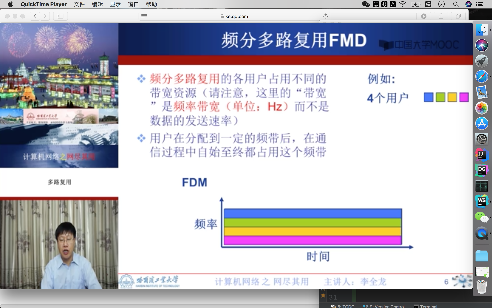
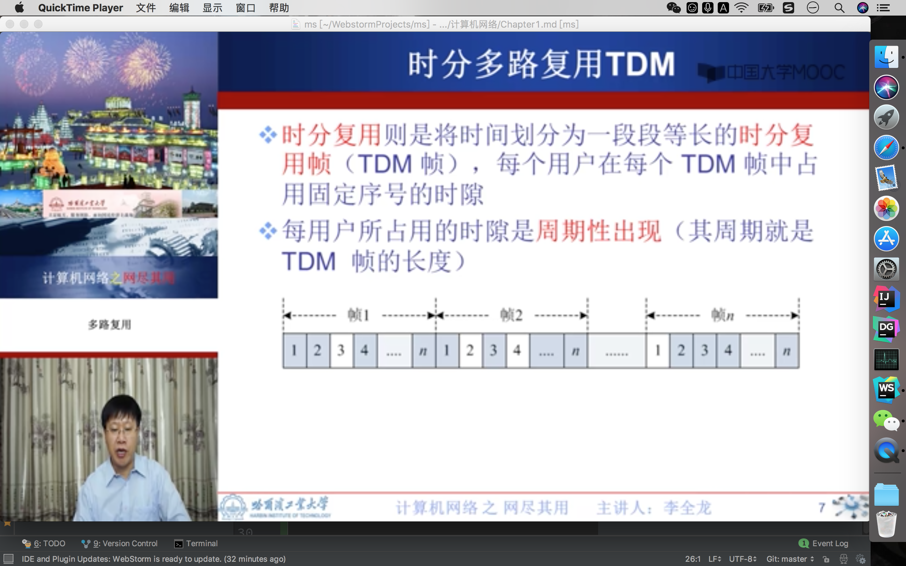
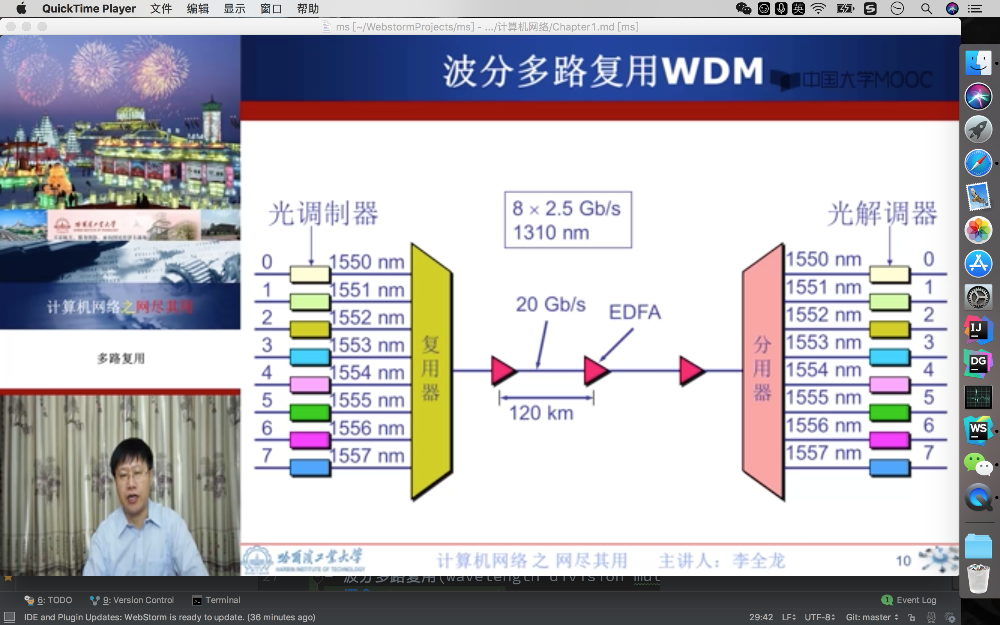
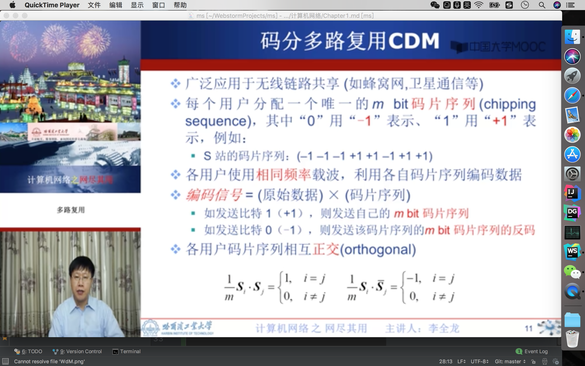

# 概述

---

## 定义

> 计算机网络就是`互连`的，`自洽`的计算机集合。
- 互连:互相连通。
- 自洽:无主从关系。

> 计算机网络是`计算机技术`和`通信技术`紧密结合的产物。
---

## 多路复用(multiplexing)

>* 链路/网络资源(如带宽)划分为*资源片*
>* 将资源片分配给各路*呼叫*(calls)
>* 没路呼叫*独占*分配到的资源片进行通信
>* 资源片可能*闲置(idle)*

### 典型多路复用方法
- 频分多路复用(frequency division mutiplexing-`FDM`)
>* 指各用户占用不同的带宽资源(这里的`带宽`指`频率带宽`而不是数据的发送频率。)
>* 用户在分配到一定的频带后，在通信过程中至始至终都占用这个频带。

- 时分多路复用(time division mutiplexing-`TDM`)

- 波分多路复用(wavelength division mutiplexing-`WDM`)

- 码分多路复用(code division mutiplexing-`CDM`)

---

